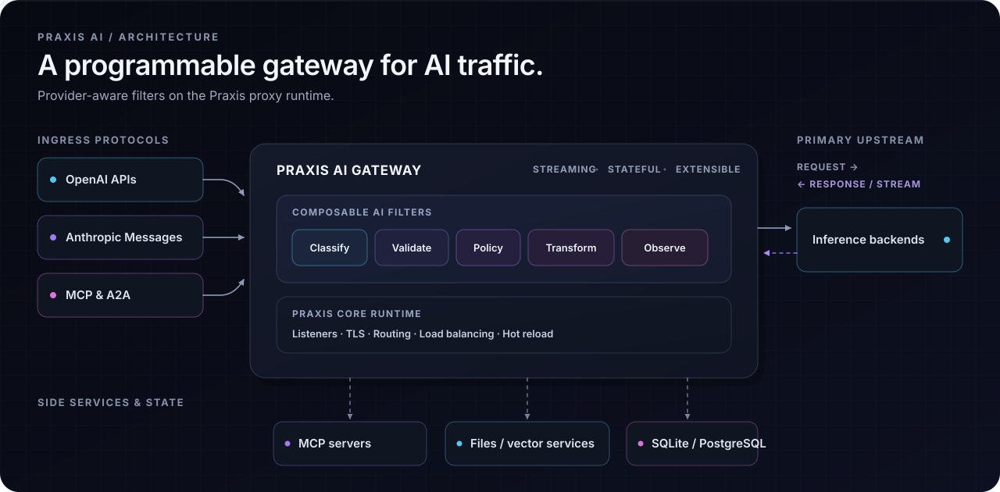

<p align="center">
  
</p>

[](https://github.com/praxis-proxy/ai/actions/workflows/tests.yaml)
[](https://github.com/praxis-proxy/ai/actions/workflows/coverage.yaml)
[](https://blog.rust-lang.org/)
[](LICENSE)

**Praxis AI is a programmable gateway for AI traffic.** It extends
[Praxis](https://github.com/praxis-proxy/praxis) with provider-aware filters,
agentic protocols, response storage, guardrails, and observability—all
configured at the proxy layer.

Use it to route requests by model or API format, translate between provider
protocols, enrich prompts, manage OpenAI Responses state, broker MCP and A2A
traffic, and expose token usage without coupling those concerns to every
application.

## What can it do?

- **Route AI traffic** by model, provider format, tool composition, or other
  facts extracted from a request.
- **Bridge provider APIs** with support for OpenAI Responses and Conversations,
  Anthropic Messages, and streaming event translation.
- **Support agentic workloads** through MCP and A2A classification, brokering,
  and routing.
- **Add gateway capabilities** such as credential injection, prompt enrichment,
  external guardrails, token accounting, and SQLite or PostgreSQL response
  storage.
- **Stay extensible** with custom Rust filters built on Praxis's `HttpFilter`
  interface.

See the [complete feature overview](docs/features.md) and
[filter reference](docs/filters/README.md) for the full list.

## Architecture

Clients keep their provider-native protocols while Praxis AI classifies,
transforms, and routes traffic through one policy-driven gateway.



### Why is this separate from praxis-proxy/praxis?

The [praxis-proxy/praxis] repository is considered the "core" framework
and standard server build for Praxis.

The separation of repositories for clear contiguous themes in the Praxis
organization is a **very explicit** choice at the core of Praxis architectural
philosophy. We practice a very diligent separation of concerns. This
particular separation provides:

* This Cleanly separates different technical domains and competencies for
  our contributors.
* The `praxis-proxy/praxis` core repo no need for dependency on `ai`: we
  explicitly support standard use cases without AI.
* Reduces the tendency for overreach from one subsystem to another, which
  encourages cleaner APIs and library surfaces.
* AI capabilities generally move and change **much faster** than the standard
  networking proxy technology in core, as that ecosystem is very mature.

See our [conventions] for more details on our development practices and
philosophies.

[praxis-proxy/praxis]:https://github.com/praxis-proxy/praxis
[conventions]:https://github.com/praxis-proxy/conventions

## Quick start

Build and start the gateway with its built-in configuration:

```console
make release
./target/release/praxis-ai
```

Then check that it is running:

```console
curl http://127.0.0.1:8080/
```

```json
{"status": "ok", "server": "praxis-ai"}
```

Ready to connect a backend? Follow the [quickstart](docs/quickstart.md), or
choose from the [example configurations](examples/README.md) for OpenAI,
Anthropic, MCP, A2A, routing, guardrails, token usage, and more.

## Learn your way around

| If you want to… | Start here |
| --- | --- |
| Run Praxis AI locally | [Quickstart](docs/quickstart.md) |
| Browse supported capabilities | [Feature overview](docs/features.md) |
| Configure a filter | [Filter reference](docs/filters/README.md) |
| Understand the design | [Architecture docs](docs/README.md#architecture) |
| Build or test the workspace | [Development guide](docs/developing/getting-started.md) |
| Add a new filter | [Adding filters](docs/developing/adding-filters.md) |

Praxis AI handles the AI-specific layer. For listeners, TLS, load balancing,
rate limiting, health checks, and other core proxy features, visit the
[Praxis repository](https://github.com/praxis-proxy/praxis).

> [!IMPORTANT]
> Praxis AI is alpha software. APIs, configuration, and operational
> behavior may change before `v1.0.0`. See the [security policy]
> for the supported release line.

Released container images are available from
[`ghcr.io/praxis-proxy/ai`][container images]. Source builds and local
development instructions are in the [development guide].

```console
docker pull ghcr.io/praxis-proxy/ai:0.1
```

Podman can pull the same OCI image. See the [quickstart] for a source build
and the [release documentation] for image contents and tagging.

## Contributing

Contributions are welcome, from bug reports and documentation fixes to new
filters and protocol support. Before opening a pull request, please read the
[contributing guide](CONTRIBUTING.md) and
[development setup](docs/developing/getting-started.md).

For larger changes, open a [feature request] and follow the
[proposal process](https://github.com/praxis-proxy/enhancements) so we can shape the idea together.

[Open an issue][issues] · [Request a feature][feature request] ·
[Open a pull request][pull requests]

[issues]: https://github.com/praxis-proxy/ai/issues/new
[pull requests]: https://github.com/praxis-proxy/ai/compare
[container images]: https://github.com/praxis-proxy/ai/pkgs/container/ai
[development guide]: docs/developing/getting-started.md
[feature request]: https://github.com/praxis-proxy/ai/issues/new?template=feature-request.yml
[quickstart]: docs/quickstart.md
[release documentation]: docs/release.md
[security policy]: SECURITY.md
