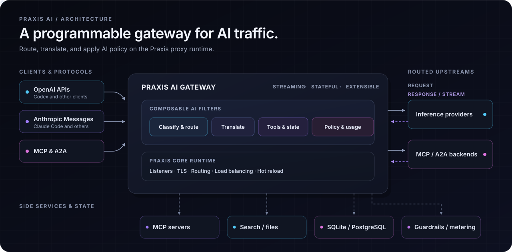

[](https://github.com/praxis-proxy/ai/actions/workflows/tests.yaml)
[](https://github.com/praxis-proxy/ai/actions/workflows/coverage.yaml)
[](https://blog.rust-lang.org/)
[](LICENSE)

**Praxis AI is an AI gateway built on
[Praxis](https://github.com/praxis-proxy/praxis).** It brings provider-aware
routing, protocol translation, stateful OpenAI APIs, and agent traffic into a
configurable proxy. Clients keep their API shape while the gateway selects
backends and applies policy.

## What can it do?

- **Route by what a request contains.** Classify OpenAI Responses, Chat
  Completions, and Anthropic Messages traffic; select backends by API format,
  model, or MCP tool name. See the
  [unified gateway](examples/configs/anthropic/unified-gateway.yaml) and
  [intelligent routing](examples/configs/intelligent-route-all-capabilities.yaml)
  examples.
- **Proxy or translate provider APIs.** Forward native provider traffic or
  serve Anthropic Messages and OpenAI Responses clients from Chat
  Completions-compatible backends, including streaming responses. See the
  [Anthropic](examples/configs/anthropic/messages-to-openai.yaml)
  and [Responses](examples/configs/openai/responses/codex-http-chat-translation.yaml)
  examples.
- **Code harness support.** Run Codex through OpenAI Responses and Claude Code
  through Anthropic Messages. The
  [coding client guide](docs/developing/cli-vllm-through-praxis.md) shows both
  clients reaching native vLLM endpoints or Chat Completions through translation.
- **Manage OpenAI response state.** Persist and rehydrate Responses history,
  serve Conversations endpoints locally, and use PostgreSQL or SQLite for
  storage. Fully supports both OpenAI Python SDK 2.x and 3.x client versions. See the [response store guide](docs/architecture/response-store.md)
  and [Conversations example](examples/configs/openai/conversations/conversations.yaml).
- **Connect tools and agents.** Run Responses tool loops with MCP, web search,
  and file search; route stateless MCP calls and A2A task follow-ups. See the
  [agentic Responses](examples/configs/openai/responses/full-flow-agentic.yaml),
  [MCP broker](examples/configs/mcp-stateless-broker.yaml), and
  [A2A routing](examples/configs/a2a-task-routing.yaml) examples.
- **Apply policy and measure usage.** Inject upstream credentials, enrich
  prompts, call external guardrails, expose token usage, and report metering
  data. See the [feature overview](docs/features.md) for details.
- **Extend the pipeline** with custom Rust filters built on Praxis's
  `HttpFilter` interface.

See the [complete feature overview](docs/features.md) and
[filter reference](docs/filters/README.md) for the full list.

## Architecture

Clients keep their provider-native protocols while Praxis AI classifies,
transforms, and routes traffic through one policy-driven gateway.



### Praxis AI and Praxis

[Praxis][praxis-proxy/praxis] supplies the proxy runtime, listeners, TLS, load
balancing, and filter framework. Praxis AI packages the AI-specific filters
and server on top of it. Keeping them in separate repositories lets the AI
integrations evolve independently while Praxis remains useful for general
proxy workloads. See our [conventions] for the project structure and
development practices.

[praxis-proxy/praxis]:https://github.com/praxis-proxy/praxis
[conventions]:https://github.com/praxis-proxy/conventions

## Quick start

Build and start the gateway with its built-in configuration:

```console
make release
./target/release/praxis-ai
```

`make release` builds the `full` feature set. A plain
`cargo build -p praxis-ai-proxy` builds the smaller `standard` set, which
leaves out the stateful OpenAI filter groups and their dependencies; see
[Cargo features](docs/features.md#cargo-features).

Then check that it is running:

```console
curl http://127.0.0.1:8080/
```

```json
{"status": "ok", "server": "praxis-ai"}
```

Ready to connect a backend? Follow the [quickstart](docs/quickstart.md), or
choose from the [example configurations](examples/README.md) for OpenAI,
Anthropic, MCP, A2A, routing, guardrails, token usage, and more.

## Learn your way around

| If you want to… | Start here |
| --- | --- |
| Run Praxis AI locally | [Quickstart](docs/quickstart.md) |
| Browse supported capabilities | [Feature overview](docs/features.md) |
| Configure a filter | [Filter reference](docs/filters/README.md) |
| Understand the design | [Architecture docs](docs/README.md#architecture) |
| Build or test the workspace | [Development guide](docs/developing/getting-started.md) |
| Add a new filter | [Adding filters](docs/developing/adding-filters.md) |

Praxis AI handles the AI-specific layer. For listeners, TLS, load balancing,
rate limiting, health checks, and other core proxy features, visit the
[Praxis repository](https://github.com/praxis-proxy/praxis).

> [!IMPORTANT]
> Praxis AI is alpha software. APIs, configuration, and operational
> behavior may change before `v1.0.0`. See the [security policy]
> for the supported release line.

Released container images are available from
[`ghcr.io/praxis-proxy/ai`][container images]. Source builds and local
development instructions are in the [development guide].

```console
docker pull ghcr.io/praxis-proxy/ai:latest
```

Podman can pull the same OCI image. See the [quickstart] for a source build
and the [release documentation] for image contents and tagging. A FIPS 140-3
build for Red Hat Enterprise Linux hosts is published under the same tags
with a `-fips` suffix (for example `latest-fips`); see
[FIPS 140-3](docs/fips.md).

## Contributing

Contributions are welcome, from bug reports and documentation fixes to new
filters and protocol support. Before opening a pull request, please read the
[contributing guide](.github/CONTRIBUTING.md) and
[development setup](docs/developing/getting-started.md).

For larger changes, open a [feature request] and follow the
[proposal process](https://github.com/praxis-proxy/enhancements) so we can shape the idea together.

[Open an issue][issues] · [Request a feature][feature request] ·
[Open a pull request][pull requests]

[issues]: https://github.com/praxis-proxy/ai/issues/new
[pull requests]: https://github.com/praxis-proxy/ai/compare
[container images]: https://github.com/praxis-proxy/ai/pkgs/container/ai
[development guide]: docs/developing/getting-started.md
[feature request]: https://github.com/praxis-proxy/ai/issues/new?template=feature-request.yml
[quickstart]: docs/quickstart.md
[release documentation]: docs/release.md
[security policy]: .github/SECURITY.md

## License

Apache 2.0
